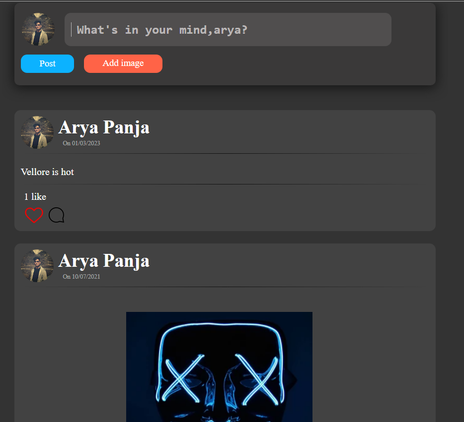

# friendsbook(a social networking site )

## Authors
* Arya Panja
    * Email <aryapanja2000@gmail.com>
    * Github [@aryapanja](https://github.com/aryapanja "Arya's github")

* Arunava Das
    * Email <arunavadas002@gmail.com>
    * Github [@arunavadas](https://github.com/Arunava2002 "Arunava's github")
    
## Website Objective
This is an implementation of a social networking website where users can stay connected with their friends, chat with them, share posts like status and images. This website is built on jsp(backend) and html/css/javascript(frontend)

## Snapshots
### Sign-in Page
Following is the landing homepage from where you can sign in to your account as well as go the create account page(Sign-up) by clicking on the 'Sign up"

### Sign-up Page
Following is the sign-up page from where you can create a new account by filling in the details

### My Page
Following is the personal page after you sign in
On the left,
* you can see friend suggestions tab where you can see other people having accounts in friendsbook; you can add them as your friend.
* additionally, you have the friend requests tab where you can either accept someone's request or delete it.

On the right,
* you can see your friend list, from there you can chat with them or remove them as friend

In the middle,
* you have the scrolling wall where you see what posts you and your friends have shared, you can like as well as comment on posts. You can also post pictures and textual information

### Friend's page
Following is the friend's wall where you can view personal account of your friends by searching their name in the search-box(situated in the top left corner)
In this page, you can view the friend list of your friend that you searched, the posts shared by him/her, the profile picture and other personal details.

### Chat page
The page shows the chatting interface

### Settings
The page where you can change your name, username, email, password and profile picture

